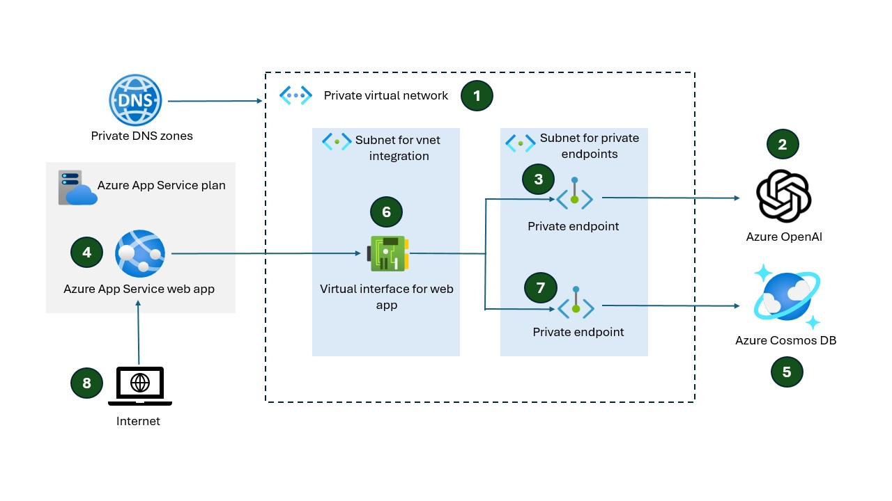

# Secure Azure OpenAI chatbot

Azure OpenAI makes it possible for anyone to create a secure chatbot. You deploy the chatbot to a web app. You can use any identity provider to configure who has access to the chatbot. The chatbots endpoint are only accessible via the private virtual network. Only the chatbot deployed to a web has access to those endpoints. 

## Architecture

## Deploy and configure

Follow these steps to deploy and configure

1. **Create a virtual network with two subnets.** Create a virtual network. Create two subnets. One subnet is for the Azure OpenAI private endpoint (called `snet-private-endpoints`). The other subnet is for the web app to integrate with the virtual network (`snet-integration`)
1. **Create Azure OpenAI service.** Follow the deployment steps. Networking and disable all network access. Private endpoint connection will be the only way to access the Azure OpenAI service and any models you deploy within it.

    Go to the Azure OpenAI Studio. In the studio, go to Deployments on the left and Create a new deployment. This step creates a new model. In the Azure OpenAI Studio, select "Chat" to enter the Chat Playground. Type a user query to test the access. You should get an error message indicating public access is disabled. This is the expected behavior. 

    In the Azure OpenAI Studio, modify the "System Message" to create a chatbot that meets your needs. Use Copilot or any generative AI tool to create the system message and examples. 
1. **Create a private endpoint for Azure OpenAI account.** Once the deployment is successful, select the Azure OpenAI resource you just created in the Azure portal. Select Networking on the left. Select Private endpoint connections. Create a new private endpoint for the Azure OpenAI service. Put the private endpoint in the virtual network and subnet you created. In the DNS section, select "Yes" to integrate with private DNS zone. This automatically creates a private endpoint, network interface card for the private endpoint, and a private DNS zone with the appropriate DNS records.

1. **Deploy chatbot to web app.** In the Chat playground, select the blue “Deploy to” button at the top right of the screen. Select a new web app. Fill out the fields to create a new web app. Make sure to select the same region as your virtual network. The web app automatically configures Microsoft Entra ID authentication (easy auth). You just need to provide authorization when you first launch the web app. 
1. **Add chat history.** You can also add chat history to the web app during the deployment options. Choosing to add chat history to the web app creates an Azure CosmosDB account and SQL database.
1. **Configure virtual network integration.** For the web app to communicate with the private endpoint, you need to enable virtual network integration. Virtual network integration routes outbound web traffic through the virtual network. To configure this, go to the Azure portal. Select the web app that you created in the previous step. Navigate to the networking blade on the left. Under “outbound traffic configuration”, select virtual network integration. Then, connect the web app to the virtual network and subnet you created for virtual network integration (`snet-integration`).
1. **Create CosmosDB private endpoint.** In the Azure portal, select that CosmosDB account that was created for chat history. Select Networking and disable all public access. Create a private endpoint for CosmosDB (account, table=SQL) and place it in the private endpoint subnet (`snet-private-endpoints`). In the DNS section, select "Yes" to integrate with private DNS zone. This automatically creates a private endpoint, network interface card for the private endpoint, and a private DNS zone with the appropriate DNS records.
1. **Launch the web app.** To launch the web app, go to the Azure portal. Select your web app and select the default domain for your web app. This launches the web app. You should see a chat screen. The web app is the only way to chat with your deployed model in Azure OpenAI. If you receive an error message, wait a few minutes for the configuration to work through the system. When it is ready, you should be able to chat with Azure OpenAI through your web. You can test the security of the endpoint by again trying to chat with your deployed model via the Azure AI Studio. You should receive the same error message, indicating that public access is disabled.

1. **Customize the web app (optional).** The web app automatically links to a Microsoft GitHub repository with all the assests to run the web app. You can fork and clone that repository, and change the source repository to your fork. You can change the identity provider and modify the code to meet your needs. [Link to the repo](https://github.com/microsoft/sample-app-aoai-chatGPT).